# Feature dictionary

Generated from the feature declarations. Do not edit by hand — rebuild with
`pmbtc feature-docs`.

**70 features** across 6 sources, 8 raw inputs.

## Raw inputs

- `clock` — feeds 15 feature(s)
- `market_meta` — feeds 2 feature(s)
- `pm_book` — feeds 33 feature(s)
- `pm_trades` — feeds 11 feature(s)
- `ref_quote` — feeds 1 feature(s)
- `ref_trades` — feeds 18 feature(s)
- `regime` — feeds 6 feature(s)
- `window_open_price` — feeds 7 feature(s)

## Source: `binance_spot`

### `tf_ref_cvd_60s`

Executed pressure on the underlying, which is what actually moves the settlement price.

| property | value |
|---|---|
| formula | `sum(size * sign) over BTC trades in (t-60s, t]` |
| inputs | `ref_trades` (raw) |
| units | BTC |
| tier | `real_time` |
| freshness budget | 60000 ms |
| reproducibility | `archived_stream` |
| group | microstructure |
| trainable | yes |

### `tf_ref_cvd_ratio_60s`

Scale-free underlying flow imbalance.

| property | value |
|---|---|
| formula | `ref_cvd_60s / ref_volume_60s` |
| inputs | `ref_trades` (raw) |
| units | ratio in [-1, 1] |
| tier | `real_time` |
| freshness budget | 60000 ms |
| reproducibility | `archived_stream` |
| group | microstructure |
| trainable | yes |

### `vm_ref_volume_60s`

Underlying activity. Drives the volatility that decides the outcome.

| property | value |
|---|---|
| formula | `sum(size) over BTC trades in (t-60s, t]` |
| inputs | `ref_trades` (raw) |
| units | BTC |
| tier | `real_time` |
| freshness budget | 60000 ms |
| reproducibility | `archived_stream` |
| group | microstructure |
| trainable | yes |

### `vm_volume_surge`

Recent volume against its own five-minute baseline. Above 1 means activity is accelerating, which usually precedes a volatility expansion.

| property | value |
|---|---|
| formula | `volume_60s / (volume_300s / 5)` |
| inputs | `ref_trades` (raw) |
| units | ratio |
| tier | `derived` |
| freshness budget | 60000 ms |
| reproducibility | `archived_stream` |
| group | microstructure |
| trainable | yes |

### `vol_price_change_bps`

Displacement from the open. The raw quantity the market resolves on.

| property | value |
|---|---|
| formula | `(price_now - price_at_window_open) / price_at_window_open * 10000` |
| inputs | `ref_trades` (raw), `window_open_price` (raw) |
| units | basis points |
| tier | `real_time` |
| freshness budget | 2000 ms |
| reproducibility | `archived_stream` |
| group | microstructure |
| trainable | yes |

### `vol_realized_300s_bps`

Window-scale volatility — the natural denominator for displacement over a 5-minute market.

| property | value |
|---|---|
| formula | `stdev(trade-to-trade returns over 300s) * 10000` |
| inputs | `ref_trades` (raw) |
| units | basis points |
| tier | `real_time` |
| freshness budget | 300000 ms |
| reproducibility | `archived_stream` |
| group | microstructure |
| trainable | yes |

### `vol_realized_30s_bps`

Very recent volatility. Reacts fastest to a regime change.

| property | value |
|---|---|
| formula | `stdev(trade-to-trade returns over 30s) * 10000` |
| inputs | `ref_trades` (raw) |
| units | basis points |
| tier | `real_time` |
| freshness budget | 30000 ms |
| reproducibility | `archived_stream` |
| group | microstructure |
| trainable | yes |

### `vol_ratio_fast_slow`

Volatility regime shift. Above 1 means the market just woke up, and a fair value computed from the slower estimate is understating uncertainty.

| property | value |
|---|---|
| formula | `realized_30s / realized_300s` |
| inputs | [`vol_realized_30s_bps`](#vol_realized_30s_bps), [`vol_realized_300s_bps`](#vol_realized_300s_bps) |
| units | ratio |
| tier | `real_time` |
| freshness budget | 30000 ms |
| reproducibility | `archived_stream` |
| group | microstructure |
| trainable | yes |

### `vol_time_scaled_sigma_bps`

How far the price can still plausibly travel before settlement. Volatility scales with the square root of time, so this shrinks as the window closes — which is why late displacement is so much more decisive.

| property | value |
|---|---|
| formula | `realized_300s_bps * sqrt(seconds_remaining / 300)` |
| inputs | [`vol_realized_300s_bps`](#vol_realized_300s_bps), `clock` (raw) |
| units | basis points |
| tier | `derived` |
| freshness budget | 2000 ms |
| reproducibility | `archived_stream` |
| group | microstructure |
| trainable | yes |

### `vol_distance_in_sigma`

THE fair-value input. Displacement measured in units of the movement still available. Large magnitude means the outcome is close to decided.

| property | value |
|---|---|
| formula | `price_change_bps / time_scaled_sigma_bps` |
| inputs | [`vol_price_change_bps`](#vol_price_change_bps), [`vol_time_scaled_sigma_bps`](#vol_time_scaled_sigma_bps) |
| units | standard deviations |
| tier | `derived` |
| freshness budget | 2000 ms |
| reproducibility | `archived_stream` |
| group | microstructure |
| trainable | yes |

### `xm_ref_spread_bps`

Liquidity of the underlying. A widening reference spread usually precedes a volatility burst.

| property | value |
|---|---|
| formula | `(ref_ask - ref_bid) / ref_mid * 10000` |
| inputs | `ref_quote` (raw) |
| units | basis points |
| tier | `real_time` |
| freshness budget | 2000 ms |
| reproducibility | `archived_stream` |
| group | microstructure |
| trainable | yes |

### `xm_vwap_deviation_bps`

Distance from the 60-second volume-weighted average. Mean reversion toward VWAP is one of the more durable short-horizon regularities.

| property | value |
|---|---|
| formula | `(price - vwap_60s) / vwap_60s * 10000` |
| inputs | `ref_trades` (raw) |
| units | basis points |
| tier | `real_time` |
| freshness budget | 60000 ms |
| reproducibility | `archived_stream` |
| group | microstructure |
| trainable | yes |

## Source: `coinglass`

### `rg_funding_rate`

Cost of holding leveraged length. Extreme funding marks crowded positioning, which changes how the market responds to a shock.

| property | value |
|---|---|
| formula | `latest perpetual funding rate for BTC` |
| inputs | `regime` (raw) |
| units | rate per interval |
| tier | `delayed` |
| freshness budget | 28800000 ms |
| reproducibility | `rest_replayable` |
| group | regime |
| trainable | yes |

### `rg_liquidations_5m_usd`

Forced flow. A liquidation cascade produces exactly the sharp, one-directional moves that decide these markets.

| property | value |
|---|---|
| formula | `sum(liquidation notional over the last 5 minutes)` |
| inputs | `regime` (raw) |
| units | USD |
| tier | `delayed` |
| freshness budget | 300000 ms |
| reproducibility | `rest_replayable` |
| group | regime |
| trainable | yes |

### `rg_long_short_ratio`

Crowd positioning. Useful mainly at extremes, and mainly as a contrarian conditioner.

| property | value |
|---|---|
| formula | `long_accounts / short_accounts` |
| inputs | `regime` (raw) |
| units | ratio |
| tier | `delayed` |
| freshness budget | 3600000 ms |
| reproducibility | `rest_replayable` |
| group | regime |
| trainable | yes |

### `rg_open_interest_change_1h`

Whether leverage is being added or unwound. Rising OI into a move means conviction; falling OI means liquidation.

| property | value |
|---|---|
| formula | `(oi_now - oi_1h_ago) / oi_1h_ago` |
| inputs | `regime` (raw) |
| units | fraction |
| tier | `delayed` |
| freshness budget | 3600000 ms |
| reproducibility | `rest_replayable` |
| group | regime |
| trainable | yes |

## Source: `derived`

### `tm_is_weekend`

Crypto trades continuously but weekend liquidity and volatility regimes differ measurably.

| property | value |
|---|---|
| formula | `1 if UTC weekday in {Sat, Sun} else 0` |
| inputs | `clock` (raw) |
| units | indicator |
| tier | `static` |
| freshness budget | 86400000 ms |
| reproducibility | `derived_from_archive` |
| group | regime |
| trainable | yes |

### `tm_minute_cos`

Cyclical time-of-day encoding, paired with the sine term.

| property | value |
|---|---|
| formula | `cos(2*pi*minute_of_day / 1440)` |
| inputs | `clock` (raw) |
| units | dimensionless |
| tier | `static` |
| freshness budget | 60000 ms |
| reproducibility | `derived_from_archive` |
| group | short_term |
| trainable | yes |

### `tm_minute_sin`

Cyclical time-of-day encoding. Sine and cosine together avoid the discontinuity at midnight that a raw minute counter would introduce.

| property | value |
|---|---|
| formula | `sin(2*pi*minute_of_day / 1440)` |
| inputs | `clock` (raw) |
| units | dimensionless |
| tier | `static` |
| freshness budget | 60000 ms |
| reproducibility | `derived_from_archive` |
| group | short_term |
| trainable | yes |

### `tm_seconds_to_settlement`

Time left. Every other time feature is a transform of this one.

| property | value |
|---|---|
| formula | `(settlement_ms - t) / 1000` |
| inputs | `clock` (raw) |
| units | seconds |
| tier | `derived` |
| freshness budget | 1000 ms |
| reproducibility | `derived_from_archive` |
| group | short_term |
| trainable | yes |

### `tm_session_code`

Trading session. Kept ordinal rather than one-hot so tree models can split on it directly; linear models should one-hot it downstream.

| property | value |
|---|---|
| formula | `ordinal of {asia:0, london:1, overlap:2, new_york:3, late_us:4}` |
| inputs | `clock` (raw) |
| units | ordinal |
| tier | `static` |
| freshness budget | 3600000 ms |
| reproducibility | `derived_from_archive` |
| group | short_term |
| trainable | yes |

### `tm_window_progress`

Position within the window, independent of window length.

| property | value |
|---|---|
| formula | `(t - window_open) / (settlement - window_open)` |
| inputs | `clock` (raw) |
| units | fraction in [0, 1] |
| tier | `derived` |
| freshness budget | 1000 ms |
| reproducibility | `derived_from_archive` |
| group | short_term |
| trainable | yes |

### `tm_sqrt_time_remaining`

The scale of remaining uncertainty. Volatility grows with sqrt(time), so this — not linear time — is how far the price can still travel.

| property | value |
|---|---|
| formula | `sqrt(max(0, 1 - window_progress))` |
| inputs | [`tm_window_progress`](#tm_window_progress) |
| units | fraction |
| tier | `derived` |
| freshness budget | 1000 ms |
| reproducibility | `derived_from_archive` |
| group | short_term |
| trainable | yes |

### `vm_pm_ref_volume_ratio`

Relative engagement between the two markets. A spike means the prediction market is reacting to something the underlying is not.

| property | value |
|---|---|
| formula | `pm_notional_60s / ref_volume_60s` |
| inputs | [`vm_pm_notional_60s`](#vm_pm_notional_60s), [`vm_ref_volume_60s`](#vm_ref_volume_60s) |
| units | USDC per BTC |
| tier | `derived` |
| freshness budget | 60000 ms |
| reproducibility | `archived_stream` |
| group | microstructure |
| trainable | yes |

### `vol_implied_fair_up`

Closed-form P(Up) under a driftless Gaussian random walk. Not a trading signal on its own — it is the null hypothesis the model must beat, and the anchor its predictions are compared against.

| property | value |
|---|---|
| formula | `Phi(distance_in_sigma), the standard normal CDF` |
| inputs | [`vol_distance_in_sigma`](#vol_distance_in_sigma) |
| units | probability |
| tier | `derived` |
| freshness budget | 2000 ms |
| reproducibility | `archived_stream` |
| group | microstructure |
| trainable | yes |

### `vol_model_market_gap`

Disagreement between the random-walk fair value and the book. The first place to look for edge, and equally the first place to look for a bug.

| property | value |
|---|---|
| formula | `implied_fair_up - ob_mid` |
| inputs | [`vol_implied_fair_up`](#vol_implied_fair_up), [`ob_mid`](#ob_mid) |
| units | probability |
| tier | `derived` |
| freshness budget | 2000 ms |
| reproducibility | `archived_stream` |
| group | microstructure |
| trainable | yes |

### `pb_edge_vs_fair`

Model-market disagreement expressed in units of transaction cost. An edge smaller than the spread is not tradeable however real it is.

| property | value |
|---|---|
| formula | `(implied_fair_up - mid) / spread, when spread > 0` |
| inputs | [`vol_model_market_gap`](#vol_model_market_gap), [`ob_spread`](#ob_spread) |
| units | spreads |
| tier | `derived` |
| freshness budget | 2000 ms |
| reproducibility | `archived_stream` |
| group | microstructure |
| trainable | yes |

### `xm_flow_price_elasticity`

How much the price moved per unit of signed flow. Low elasticity means the market absorbed the flow — a sign of a strong resting bid or offer.

| property | value |
|---|---|
| formula | `price_change_bps / ref_cvd_60s` |
| inputs | [`vol_price_change_bps`](#vol_price_change_bps), [`tf_ref_cvd_60s`](#tf_ref_cvd_60s) |
| units | bps per BTC |
| tier | `derived` |
| freshness budget | 60000 ms |
| reproducibility | `archived_stream` |
| group | microstructure |
| trainable | yes |

### `xm_ref_pm_lead_bps`

Underlying displacement minus the displacement the book's probability implies. Positive means BTC has moved further than the prediction market has priced — the book is lagging.

| property | value |
|---|---|
| formula | `price_change_bps - (mid - 0.5) * 2 * time_scaled_sigma_bps` |
| inputs | [`vol_price_change_bps`](#vol_price_change_bps), [`ob_mid`](#ob_mid), [`vol_time_scaled_sigma_bps`](#vol_time_scaled_sigma_bps) |
| units | basis points |
| tier | `real_time` |
| freshness budget | 2000 ms |
| reproducibility | `archived_stream` |
| group | microstructure |
| trainable | yes |

## Source: `fear_greed`

### `rg_fear_greed`

Daily sentiment. Included for completeness and expected to be pruned: a value that changes once a day cannot inform a 300-second forecast.

| property | value |
|---|---|
| formula | `Fear & Greed index, 0-100` |
| inputs | `regime` (raw) |
| units | index |
| tier | `delayed` |
| freshness budget | 172800000 ms |
| reproducibility | `rest_replayable` |
| group | regime |
| trainable | yes |

## Source: `macro_calendar`

### `rg_macro_event_proximity`

Nearness to a scheduled macro release. Approaching 1 means a volatility jump is scheduled, and any volatility estimate from the recent past is about to be wrong.

| property | value |
|---|---|
| formula | `1 / (1 + minutes_to_nearest_high_impact_event)` |
| inputs | `regime` (raw) |
| units | ratio in (0, 1] |
| tier | `delayed` |
| freshness budget | 3600000 ms |
| reproducibility | `rest_replayable` |
| group | regime |
| trainable | yes |

## Source: `polymarket_clob`

### `lq_depth_ask_usdc`

Capital resting on the ask — how much can be bought.

| property | value |
|---|---|
| formula | `sum((1 - price) * size) over the top 10 ask levels` |
| inputs | `pm_book` (raw) |
| units | USDC |
| tier | `real_time` |
| freshness budget | 2000 ms |
| reproducibility | `archived_stream` |
| group | microstructure |
| trainable | yes |

### `lq_depth_bid_usdc`

Capital resting on the bid — how much can be sold into.

| property | value |
|---|---|
| formula | `sum(price * size) over the top 10 bid levels` |
| inputs | `pm_book` (raw) |
| units | USDC |
| tier | `real_time` |
| freshness budget | 2000 ms |
| reproducibility | `archived_stream` |
| group | microstructure |
| trainable | yes |

### `lq_slippage_100`

Actual cost of a realistic clip, walked through the real ladder rather than assumed from the touch.

| property | value |
|---|---|
| formula | `avg_fill_price(100 shares, lifting asks) - best_ask` |
| inputs | `pm_book` (raw) |
| units | probability |
| tier | `real_time` |
| freshness budget | 2000 ms |
| reproducibility | `archived_stream` |
| group | microstructure |
| trainable | yes |

### `lq_slippage_500`

Cost of a larger clip. The gap between this and the 100-share figure is how quickly the book thins out.

| property | value |
|---|---|
| formula | `avg_fill_price(500 shares, lifting asks) - best_ask` |
| inputs | `pm_book` (raw) |
| units | probability |
| tier | `real_time` |
| freshness budget | 2000 ms |
| reproducibility | `archived_stream` |
| group | microstructure |
| trainable | yes |

### `lq_book_convexity`

How fast liquidity disappears with size. A high ratio means the top of book is a mirage and real size cannot be done at the quoted price.

| property | value |
|---|---|
| formula | `slippage_500 / slippage_100` |
| inputs | [`lq_slippage_500`](#lq_slippage_500), [`lq_slippage_100`](#lq_slippage_100) |
| units | ratio |
| tier | `derived` |
| freshness budget | 2000 ms |
| reproducibility | `archived_stream` |
| group | microstructure |
| trainable | yes |

### `lq_total_depth_usdc`

Total committed capital. The headline liquidity gate.

| property | value |
|---|---|
| formula | `depth_bid_usdc + depth_ask_usdc` |
| inputs | [`lq_depth_bid_usdc`](#lq_depth_bid_usdc), [`lq_depth_ask_usdc`](#lq_depth_ask_usdc) |
| units | USDC |
| tier | `derived` |
| freshness budget | 2000 ms |
| reproducibility | `archived_stream` |
| group | microstructure |
| trainable | yes |

### `ms_book_levels`

How populated the ladder is. A book with three levels behaves nothing like one with sixty, even at the same spread.

| property | value |
|---|---|
| formula | `count(bid levels) + count(ask levels)` |
| inputs | `pm_book` (raw) |
| units | levels |
| tier | `real_time` |
| freshness budget | 2000 ms |
| reproducibility | `archived_stream` |
| group | microstructure |
| trainable | yes |

### `ms_depth_asymmetry`

Capital-weighted book skew. Complements share-count imbalance, which over-weights cheap size far from the touch.

| property | value |
|---|---|
| formula | `(depth_bid_usdc - depth_ask_usdc) / (depth_bid_usdc + depth_ask_usdc)` |
| inputs | [`lq_depth_bid_usdc`](#lq_depth_bid_usdc), [`lq_depth_ask_usdc`](#lq_depth_ask_usdc) |
| units | ratio in [-1, 1] |
| tier | `derived` |
| freshness budget | 2000 ms |
| reproducibility | `archived_stream` |
| group | microstructure |
| trainable | yes |

### `ms_queue_ratio`

Relative queue lengths at the touch. Determines which side clears first, and therefore which way the touch is likely to move.

| property | value |
|---|---|
| formula | `best_bid_size / best_ask_size` |
| inputs | `pm_book` (raw) |
| units | ratio |
| tier | `real_time` |
| freshness budget | 2000 ms |
| reproducibility | `archived_stream` |
| group | microstructure |
| trainable | yes |

### `ob_best_ask`

Lowest price anyone will sell Up at. The cost of buying immediately.

| property | value |
|---|---|
| formula | `min{p : size(p) > 0, p in asks}` |
| inputs | `pm_book` (raw) |
| units | probability |
| tier | `real_time` |
| freshness budget | 2000 ms |
| reproducibility | `archived_stream` |
| group | microstructure |
| trainable | yes |

### `ob_best_bid`

Highest price anyone will pay for Up. The floor of executable value.

| property | value |
|---|---|
| formula | `max{p : size(p) > 0, p in bids}` |
| inputs | `pm_book` (raw) |
| units | probability |
| tier | `real_time` |
| freshness budget | 2000 ms |
| reproducibility | `archived_stream` |
| group | microstructure |
| trainable | yes |

### `ob_book_pressure_ratio`

Capital committed to each side, rather than share count. Large size at a low price is much less capital than the same size near 1.

| property | value |
|---|---|
| formula | `notional_bid_depth_10 / notional_ask_depth_10` |
| inputs | `pm_book` (raw) |
| units | ratio |
| tier | `real_time` |
| freshness budget | 2000 ms |
| reproducibility | `archived_stream` |
| group | microstructure |
| trainable | yes |

### `ob_complement_gap`

Arbitrage residual across the two complementary tokens. Non-zero means a real arb or, more often, one stale side — so it is a data-quality signal too.

| property | value |
|---|---|
| formula | `mid(Up) + mid(Down) - 1` |
| inputs | `pm_book` (raw) |
| units | probability |
| tier | `real_time` |
| freshness budget | 2000 ms |
| reproducibility | `archived_stream` |
| group | microstructure |
| trainable | yes |

### `ob_imbalance_1`

Touch imbalance. The classic short-horizon predictor: more size bid than offered is weak evidence the next tick is up.

| property | value |
|---|---|
| formula | `(bid_size_L1 - ask_size_L1) / (bid_size_L1 + ask_size_L1)` |
| inputs | `pm_book` (raw) |
| units | ratio in [-1, 1] |
| tier | `real_time` |
| freshness budget | 2000 ms |
| reproducibility | `archived_stream` |
| group | microstructure |
| trainable | yes |

### `ob_imbalance_20`

Deep-book imbalance. Closer to positioning than to intent.

| property | value |
|---|---|
| formula | `(sum bid_size over 20 levels - sum ask_size over 20) / total` |
| inputs | `pm_book` (raw) |
| units | ratio in [-1, 1] |
| tier | `real_time` |
| freshness budget | 2000 ms |
| reproducibility | `archived_stream` |
| group | microstructure |
| trainable | yes |

### `ob_imbalance_5`

Depth-weighted imbalance. Less noisy than the touch, slower to react.

| property | value |
|---|---|
| formula | `(sum bid_size over 5 levels - sum ask_size over 5) / total` |
| inputs | `pm_book` (raw) |
| units | ratio in [-1, 1] |
| tier | `real_time` |
| freshness budget | 2000 ms |
| reproducibility | `archived_stream` |
| group | microstructure |
| trainable | yes |

### `ob_imbalance_slope`

Whether pressure at the touch agrees with pressure deep in the book. Disagreement often precedes a reversal.

| property | value |
|---|---|
| formula | `imbalance_1 - imbalance_20` |
| inputs | [`ob_imbalance_1`](#ob_imbalance_1), [`ob_imbalance_20`](#ob_imbalance_20) |
| units | ratio |
| tier | `real_time` |
| freshness budget | 2000 ms |
| reproducibility | `archived_stream` |
| group | microstructure |
| trainable | yes |

### `ob_microprice`

Size-weighted fair value. Leans toward the thinner side, which is the side about to be consumed, so it leads the mid.

| property | value |
|---|---|
| formula | `(bid * ask_size + ask * bid_size) / (bid_size + ask_size)` |
| inputs | `pm_book` (raw) |
| units | probability |
| tier | `real_time` |
| freshness budget | 2000 ms |
| reproducibility | `archived_stream` |
| group | microstructure |
| trainable | yes |

### `ob_mid`

The market's headline probability of Up. The benchmark every model prediction is measured against.

| property | value |
|---|---|
| formula | `(best_bid + best_ask) / 2, clamped to [0.001, 0.999]` |
| inputs | [`ob_best_bid`](#ob_best_bid), [`ob_best_ask`](#ob_best_ask) |
| units | probability |
| tier | `real_time` |
| freshness budget | 2000 ms |
| reproducibility | `archived_stream` |
| group | microstructure |
| trainable | yes |

### `ms_quote_stability`

How still the quote is between passes. Flickering quotes mean market makers are uncertain, and any single reading of the book is less meaningful.

| property | value |
|---|---|
| formula | `1 / (1 + |mid_t - mid_{t-1}| / tick_size)` |
| inputs | [`ob_mid`](#ob_mid), `market_meta` (raw) |
| units | ratio in (0, 1] |
| tier | `derived` |
| freshness budget | 2000 ms |
| reproducibility | `archived_stream` |
| group | microstructure |
| trainable | yes |

### `ob_microprice_edge`

How far size-weighted value has moved ahead of the mid. A small, persistent, directional signal.

| property | value |
|---|---|
| formula | `microprice - mid` |
| inputs | [`ob_microprice`](#ob_microprice), [`ob_mid`](#ob_mid) |
| units | probability |
| tier | `real_time` |
| freshness budget | 2000 ms |
| reproducibility | `archived_stream` |
| group | microstructure |
| trainable | yes |

### `ob_spread`

Round-trip cost of demanding liquidity, and a direct proxy for how confident market makers are.

| property | value |
|---|---|
| formula | `best_ask - best_bid` |
| inputs | [`ob_best_bid`](#ob_best_bid), [`ob_best_ask`](#ob_best_ask) |
| units | probability |
| tier | `real_time` |
| freshness budget | 2000 ms |
| reproducibility | `archived_stream` |
| group | microstructure |
| trainable | yes |

### `lq_spread_to_depth`

Cost per unit of available liquidity. Distinguishes a tight-but-thin book from a wide-but-deep one, which raw spread cannot.

| property | value |
|---|---|
| formula | `spread / log(1 + total_depth_usdc)` |
| inputs | [`ob_spread`](#ob_spread), [`lq_total_depth_usdc`](#lq_total_depth_usdc) |
| units | probability per log-USDC |
| tier | `derived` |
| freshness budget | 2000 ms |
| reproducibility | `archived_stream` |
| group | microstructure |
| trainable | yes |

### `ms_spread_ticks`

Spread in units of the minimum increment. A one-tick spread is the tightest a market can be, whatever the tick happens to be.

| property | value |
|---|---|
| formula | `spread / tick_size` |
| inputs | [`ob_spread`](#ob_spread), `market_meta` (raw) |
| units | ticks |
| tier | `derived` |
| freshness budget | 2000 ms |
| reproducibility | `archived_stream` |
| group | microstructure |
| trainable | yes |

### `pb_conviction`

How far the market is from a coin flip. Near zero the outcome is genuinely open; near 0.5 it is effectively decided.

| property | value |
|---|---|
| formula | `|mid - 0.5|` |
| inputs | [`ob_mid`](#ob_mid) |
| units | probability |
| tier | `derived` |
| freshness budget | 2000 ms |
| reproducibility | `archived_stream` |
| group | microstructure |
| trainable | yes |

### `pb_distance_from_open`

Total revision since we started watching this market. Large values mean the window has already resolved most of its uncertainty.

| property | value |
|---|---|
| formula | `mid_t - mid_at_first_observation` |
| inputs | [`ob_mid`](#ob_mid) |
| units | probability |
| tier | `derived` |
| freshness budget | 2000 ms |
| reproducibility | `archived_stream` |
| group | microstructure |
| trainable | yes |

### `pb_logit`

Probability on a log-odds scale, where moves are roughly additive. A 0.50->0.55 shift and a 0.90->0.95 shift are very different events, and the raw probability hides that; the logit does not.

| property | value |
|---|---|
| formula | `log(mid / (1 - mid))` |
| inputs | [`ob_mid`](#ob_mid) |
| units | log-odds |
| tier | `derived` |
| freshness budget | 2000 ms |
| reproducibility | `archived_stream` |
| group | microstructure |
| trainable | yes |

### `pb_velocity`

Rate of revision. A fast-moving probability means information is arriving; a static one means nothing has changed.

| property | value |
|---|---|
| formula | `(mid_t - mid_{t-1}) / elapsed_seconds` |
| inputs | [`ob_mid`](#ob_mid), `clock` (raw) |
| units | probability/second |
| tier | `derived` |
| freshness budget | 2000 ms |
| reproducibility | `archived_stream` |
| group | microstructure |
| trainable | yes |

### `pb_acceleration`

Whether revision is speeding up or petering out. Deceleration near an extreme often marks the end of a move.

| property | value |
|---|---|
| formula | `(velocity_t - velocity_{t-1}) / elapsed_seconds` |
| inputs | [`pb_velocity`](#pb_velocity), `clock` (raw) |
| units | probability/second^2 |
| tier | `derived` |
| freshness budget | 2000 ms |
| reproducibility | `archived_stream` |
| group | microstructure |
| trainable | yes |

### `tf_avg_trade_size_60s`

Retail flow arrives in small clips; informed flow tends to be larger. A jump in average size is worth noticing.

| property | value |
|---|---|
| formula | `volume_60s / count_60s` |
| inputs | `pm_trades` (raw) |
| units | shares |
| tier | `real_time` |
| freshness budget | 60000 ms |
| reproducibility | `archived_stream` |
| group | microstructure |
| trainable | yes |

### `tf_cvd_10s`

Very short-horizon executed pressure on the Up token.

| property | value |
|---|---|
| formula | `sum(size * sign) over trades in (t-10s, t]` |
| inputs | `pm_trades` (raw) |
| units | shares |
| tier | `real_time` |
| freshness budget | 10000 ms |
| reproducibility | `archived_stream` |
| group | microstructure |
| trainable | yes |

### `tf_cvd_60s`

Minute-scale executed pressure; less noisy than the 10s version.

| property | value |
|---|---|
| formula | `sum(size * sign) over trades in (t-60s, t]` |
| inputs | `pm_trades` (raw) |
| units | shares |
| tier | `real_time` |
| freshness budget | 60000 ms |
| reproducibility | `archived_stream` |
| group | microstructure |
| trainable | yes |

### `tf_cvd_acceleration`

Is recent flow faster than the minute average? Positive means pressure is building rather than decaying.

| property | value |
|---|---|
| formula | `cvd_10s - (cvd_60s / 6)` |
| inputs | [`tf_cvd_10s`](#tf_cvd_10s), [`tf_cvd_60s`](#tf_cvd_60s) |
| units | shares |
| tier | `real_time` |
| freshness budget | 10000 ms |
| reproducibility | `archived_stream` |
| group | microstructure |
| trainable | yes |

### `tf_cvd_ratio_60s`

Scale-free flow imbalance, comparable between quiet and busy windows in a way the raw CVD is not.

| property | value |
|---|---|
| formula | `cvd_60s / total_volume_60s` |
| inputs | `pm_trades` (raw) |
| units | ratio in [-1, 1] |
| tier | `real_time` |
| freshness budget | 60000 ms |
| reproducibility | `archived_stream` |
| group | microstructure |
| trainable | yes |

### `tf_book_flow_agreement`

Do resting intent and executed flow point the same way? Agreement is a stronger signal than either alone; disagreement often marks absorption.

| property | value |
|---|---|
| formula | `sign(imbalance_5) * sign(cvd_ratio_60s)` |
| inputs | [`ob_imbalance_5`](#ob_imbalance_5), [`tf_cvd_ratio_60s`](#tf_cvd_ratio_60s) |
| units | sign in {-1, 0, 1} |
| tier | `real_time` |
| freshness budget | 60000 ms |
| reproducibility | `archived_stream` |
| group | microstructure |
| trainable | yes |

### `tf_flow_divergence`

Prediction-market flow against underlying flow. When the book is being bought while BTC is being sold, one of them is wrong — and historically it is more often the thinner market.

| property | value |
|---|---|
| formula | `cvd_ratio_60s - ref_cvd_ratio_60s` |
| inputs | [`tf_cvd_ratio_60s`](#tf_cvd_ratio_60s), [`tf_ref_cvd_ratio_60s`](#tf_ref_cvd_ratio_60s) |
| units | ratio |
| tier | `real_time` |
| freshness budget | 60000 ms |
| reproducibility | `archived_stream` |
| group | microstructure |
| trainable | yes |

### `tf_trade_intensity_60s`

Activity level. Near-zero intensity means any other flow feature is built on a handful of prints and should be distrusted.

| property | value |
|---|---|
| formula | `count(trades in (t-60s, t]) / 60` |
| inputs | `pm_trades` (raw) |
| units | trades/second |
| tier | `real_time` |
| freshness budget | 60000 ms |
| reproducibility | `archived_stream` |
| group | microstructure |
| trainable | yes |

### `vm_pm_notional_60s`

Capital traded rather than share count — the honest measure when prices range from 0.01 to 0.99.

| property | value |
|---|---|
| formula | `sum(price * size) over Up-token trades in (t-60s, t]` |
| inputs | `pm_trades` (raw) |
| units | USDC |
| tier | `real_time` |
| freshness budget | 60000 ms |
| reproducibility | `archived_stream` |
| group | microstructure |
| trainable | yes |

### `vm_pm_volume_60s`

Prediction-market activity. Near zero means the book's price is an opinion rather than a consensus.

| property | value |
|---|---|
| formula | `sum(size) over Up-token trades in (t-60s, t]` |
| inputs | `pm_trades` (raw) |
| units | shares |
| tier | `real_time` |
| freshness budget | 60000 ms |
| reproducibility | `archived_stream` |
| group | microstructure |
| trainable | yes |

## Dependency graph

```mermaid
graph LR
  raw_pm_book([pm_book]) --> lq_depth_ask_usdc
  raw_pm_book([pm_book]) --> lq_depth_bid_usdc
  raw_pm_book([pm_book]) --> lq_slippage_100
  raw_pm_book([pm_book]) --> lq_slippage_500
  lq_slippage_100 --> lq_book_convexity
  lq_slippage_500 --> lq_book_convexity
  lq_depth_ask_usdc --> lq_total_depth_usdc
  lq_depth_bid_usdc --> lq_total_depth_usdc
  raw_pm_book([pm_book]) --> ms_book_levels
  lq_depth_ask_usdc --> ms_depth_asymmetry
  lq_depth_bid_usdc --> ms_depth_asymmetry
  raw_pm_book([pm_book]) --> ms_queue_ratio
  raw_pm_book([pm_book]) --> ob_best_ask
  raw_pm_book([pm_book]) --> ob_best_bid
  raw_pm_book([pm_book]) --> ob_book_pressure_ratio
  raw_pm_book([pm_book]) --> ob_complement_gap
  raw_pm_book([pm_book]) --> ob_imbalance_1
  raw_pm_book([pm_book]) --> ob_imbalance_20
  raw_pm_book([pm_book]) --> ob_imbalance_5
  ob_imbalance_1 --> ob_imbalance_slope
  ob_imbalance_20 --> ob_imbalance_slope
  raw_pm_book([pm_book]) --> ob_microprice
  ob_best_ask --> ob_mid
  ob_best_bid --> ob_mid
  ob_mid --> ms_quote_stability
  raw_market_meta([market_meta]) --> ms_quote_stability
  ob_microprice --> ob_microprice_edge
  ob_mid --> ob_microprice_edge
  ob_best_ask --> ob_spread
  ob_best_bid --> ob_spread
  lq_total_depth_usdc --> lq_spread_to_depth
  ob_spread --> lq_spread_to_depth
  ob_spread --> ms_spread_ticks
  raw_market_meta([market_meta]) --> ms_spread_ticks
  ob_mid --> pb_conviction
  ob_mid --> pb_distance_from_open
  ob_mid --> pb_logit
  ob_mid --> pb_velocity
  raw_clock([clock]) --> pb_velocity
  pb_velocity --> pb_acceleration
  raw_clock([clock]) --> pb_acceleration
  raw_regime([regime]) --> rg_fear_greed
  raw_regime([regime]) --> rg_funding_rate
  raw_regime([regime]) --> rg_liquidations_5m_usd
  raw_regime([regime]) --> rg_long_short_ratio
  raw_regime([regime]) --> rg_macro_event_proximity
  raw_regime([regime]) --> rg_open_interest_change_1h
  raw_pm_trades([pm_trades]) --> tf_avg_trade_size_60s
  raw_pm_trades([pm_trades]) --> tf_cvd_10s
  raw_pm_trades([pm_trades]) --> tf_cvd_60s
  tf_cvd_10s --> tf_cvd_acceleration
  tf_cvd_60s --> tf_cvd_acceleration
  raw_pm_trades([pm_trades]) --> tf_cvd_ratio_60s
  ob_imbalance_5 --> tf_book_flow_agreement
  tf_cvd_ratio_60s --> tf_book_flow_agreement
  raw_ref_trades([ref_trades]) --> tf_ref_cvd_60s
  raw_ref_trades([ref_trades]) --> tf_ref_cvd_ratio_60s
  tf_cvd_ratio_60s --> tf_flow_divergence
  tf_ref_cvd_ratio_60s --> tf_flow_divergence
  raw_pm_trades([pm_trades]) --> tf_trade_intensity_60s
  raw_clock([clock]) --> tm_is_weekend
  raw_clock([clock]) --> tm_minute_cos
  raw_clock([clock]) --> tm_minute_sin
  raw_clock([clock]) --> tm_seconds_to_settlement
  raw_clock([clock]) --> tm_session_code
  raw_clock([clock]) --> tm_window_progress
  tm_window_progress --> tm_sqrt_time_remaining
  raw_pm_trades([pm_trades]) --> vm_pm_notional_60s
  raw_pm_trades([pm_trades]) --> vm_pm_volume_60s
  raw_ref_trades([ref_trades]) --> vm_ref_volume_60s
  vm_pm_notional_60s --> vm_pm_ref_volume_ratio
  vm_ref_volume_60s --> vm_pm_ref_volume_ratio
  raw_ref_trades([ref_trades]) --> vm_volume_surge
  raw_ref_trades([ref_trades]) --> vol_price_change_bps
  raw_window_open_price([window_open_price]) --> vol_price_change_bps
  raw_ref_trades([ref_trades]) --> vol_realized_300s_bps
  raw_ref_trades([ref_trades]) --> vol_realized_30s_bps
  vol_realized_300s_bps --> vol_ratio_fast_slow
  vol_realized_30s_bps --> vol_ratio_fast_slow
  vol_realized_300s_bps --> vol_time_scaled_sigma_bps
  raw_clock([clock]) --> vol_time_scaled_sigma_bps
  vol_price_change_bps --> vol_distance_in_sigma
  vol_time_scaled_sigma_bps --> vol_distance_in_sigma
  vol_distance_in_sigma --> vol_implied_fair_up
  ob_mid --> vol_model_market_gap
  vol_implied_fair_up --> vol_model_market_gap
  ob_spread --> pb_edge_vs_fair
  vol_model_market_gap --> pb_edge_vs_fair
  tf_ref_cvd_60s --> xm_flow_price_elasticity
  vol_price_change_bps --> xm_flow_price_elasticity
  ob_mid --> xm_ref_pm_lead_bps
  vol_price_change_bps --> xm_ref_pm_lead_bps
  vol_time_scaled_sigma_bps --> xm_ref_pm_lead_bps
  raw_ref_quote([ref_quote]) --> xm_ref_spread_bps
  raw_ref_trades([ref_trades]) --> xm_vwap_deviation_bps
```

